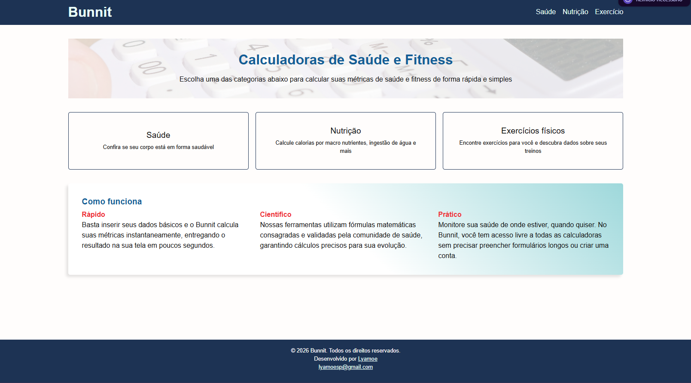

# 🐰 Bunnit 🔥

> Um conjunto de **calculadoras** e **ferramentas** voltadas para a saúde, projetadas para ajudar você a manter uma **vida mais saudável** por meio de métodos validados, atualizados e focados no seu **bem-estar**.

---

## 🎯 Principais Funcionalidades

* **Índice de Massa Corporal (IMC):** Calcule seu IMC e descubra a sua faixa de peso ideal.
* **Porcentagem de Gordura Corporal:** Acompanhe a sua composição corporal com base em métricas confiáveis.

---

## 🚀 Como Acessar

O **Bunnit** e todas as suas ferramentas estão disponíveis gratuitamente online:

👉 **[Acessar o Bunnit no GitHub Pages](https://lyamoe.github.io/Bunnit/)**

---

## 🛠️ Tecnologias Utilizadas

O projeto foi desenvolvido utilizando as seguintes tecnologias e metodologias:

* **HTML5** — Estruturação semântica do conteúdo web.
* **CSS3** — Estilização e layout responsivo.
* **Sass (SCSS)** — Pré-processador CSS utilizado para estilos com variáveis, aninhamento e mixins.
* **JavaScript (ES6+)** — Lógica da aplicação, manipulação do DOM e interatividade.
* **Convenção BEM** — Metodologia *Block Element Modifier* utilizada para nomenclatura de classes.
* **Jest** — Framework de testes em JavaScript para validação de funções e comportamentos.
